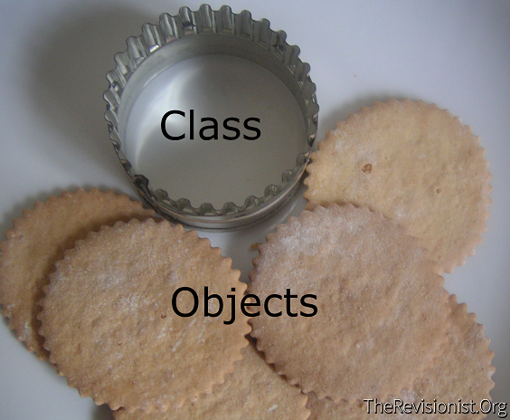

# OOP introduction

## A Great Wise Man Once gave me an explanation of OOP!


##What I've learned from the exercises so far:

###Exercise 1
- Make a new class with public properties.
- Make a public function constructor to actually create the objects with the (new) command. 
- Make a new object and print it out with the given paramaters. 

```php
<?php

class Beverage 
{
	public string $color;
    	public float $price;
   	public string $temperature;

	public function __construct(string $color, float $price)
    	{
        	$this->color = $color;
        	$this->price = $price;
        	$this->temperature = "cold";
    	}
  	public function getInfo() :string
	{
        	return "This beverage is $this->temperature temperature and is $this->color";
    	}
}

$beverage1 = new Beverage("black", 2);
echo $beverage1->getInfo();
```

###Exercise 2
- Make an extend of the previous class from Exercise 1 
- Create the constructor with the previous properties and add the parent:: __constructor with the new properties.
- Make a function to check a parameter and print it out on the screen. 

```php
<?php

	public function __construct(string $color, float $price, string $name, float$alcoholPercentage)
    	{
        	parent:: __construct($color, $price);
        	$this->name = $name;
       		$this->alcoholPercentage = $alcoholPercentage;
    	}
```

###Exercise 3
- Learned the difference between a public and a private properties of the class.
- How can we still print the paramaters with private properties? (added a getter and setter).
- Call the funtions so we can still print the parameters out.

```php
<?php

class Beverage
{
    private string $color;
    private float $price;
    private string $temperature;

	public function getAlcoholPercentage(): float
    	{
        	return $this->alcoholPercentage;
    	}

    	public function setAlcoholPercentage(float $alcoholPercentage): void
    	{
        	$this->alcoholPercentage = $alcoholPercentage;
    	}

$duvel->setAlcoholPercentage(8.5);
echo $duvel->getAlcoholPercentage();
}
```
###Exercise 4
- Learned the difference between a private and protected properties of the class.
- How can we still print the paramaters with protected properties without changing the main class.
- Call the funtions so we can still print the parameters out.

```php
<?php

class Beverage {

    protected string $color;
    protected float $price;
    protected string $temperature;

	protected function beerInfo(): string
    	{
        	return "Hi I'm " . $this->name . " and have an alcohol percentage of " . $this->alcoholPercentage . " and I have a " . $this->color . " color.";
    	}

    	public function printBeerInfo(): string
    	{
        	return $this->beerInfo();
    	}

```

###Exercise 5
- Changed the main class properties back to private. 
- How can we still print the paramaters with private properties without using the getter and setter?
- Make a new function inside the class that can still access the private properties and set that to the new variable. 
- Call the funtions so we can still print the parameters out.

```php
<?php

	function printChangedPrice(float $changePrice)
    	{
        	$this->price = $changePrice;
        	return "This $this->temperature beverage with a $this->color color will cost $this->price euro.";
    	}
```

## The introduction

OOP - `Object Orientated Programming` - focuses on the objects that developers want to manipulate rather than the logic required to manipulate them. 
This approach to programming is well-suited for programs that are large, complex and actively updated or maintained.

## The objective

> Lost for a second? Have a look at [this example](#an-example)

### 🌱 Must haves - the basics
- [Exercise 1](Exercise1.php)
- [Exercise 2](Exercise2.php)

### 🌱 Must haves - digging deeper
- [Exercise 3](Exercise3.php)
- [Exercise 4](Exercise4.php)
- [Exercise 5](Exercise5.php)

### 🌼 Nice to haves
- [Exercise 6](exercise_6_const.php)
- [Exercise 7](exercise_7_static.php)

